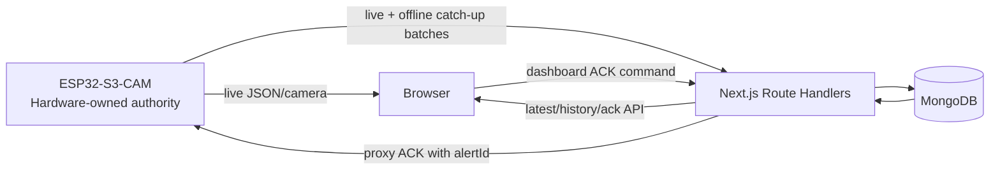

# Architecture — minimal and judge-aligned

## High-level split

## Why this split
- ESP32 must keep working if WiFi/server dies: Stages 1–9, physical alarm/ack, on-device persistence, recovery.
- Next.js makes server-side exactly-once ingestion and indexed history search easy.
- MongoDB is a **mirror/search store**, not the Stage 8 device storage.
- Browser can use the polished Next.js UI, while the ESP32 also serves a tiny judge-safe Stage 4 page.

## Next.js backend modules
- `db`: singleton Mongo client + index initialization.
- `schemas`: Zod contracts shared by routes/services.
- `ingest`: validates single/batch telemetry, deduplicates by eventId, preserves seq.
- `history`: range query by deviceId/from/to.
- `device-client`: small fetch wrapper to ESP32 endpoints with timeout.
- `alerts`: dashboard acknowledgement request + atomic mirror of device result.
- `latest-state`: latest known snapshot for frontend polling.

## Suggested routes
| Route | Purpose |
|---|---|
| `POST /api/telemetry/ingest` | live/catch-up event ingest, idempotent |
| `GET /api/telemetry/latest?deviceId=...` | latest dashboard snapshot |
| `GET /api/history?deviceId=...&from=...&to=...` | Stage 10 range search |
| `GET /api/devices/[deviceId]/state` | connection/storage/status summary if useful |
| `POST /api/alerts/[alertId]/ack` | dashboard ACK → device, then mirror result |
| `GET /api/health` | optional local integration sanity check |

## Realtime choice
Use 1-second polling. It exactly fits the 1–2 second dashboard update requirement and avoids WebSocket complexity.

## Camera choice
Do not base64-encode camera frames into MongoDB or Next.js. Browser should read the device camera endpoint directly (``/MJPEG or snapshot URL). Keep the last successful image on fetch failure.
